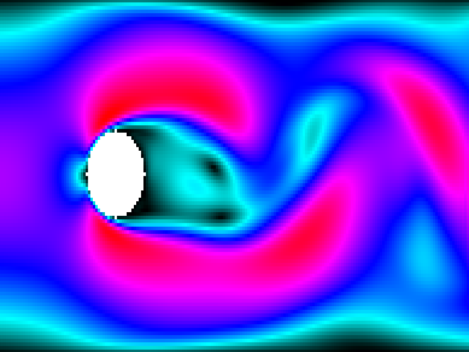

# 2d-lbm-opengl

## Description
This program simulate the flow of a liquid around a solid object using the [Lattice-Bolzmann method](https://en.wikipedia.org/wiki/Lattice_Boltzmann_methods). Particular attention was dedicated to the technology aspect (design and implementation) rather than to the algorithm itself.

## Rationale and goals
This project started as a fork of [2d-lbm-cuda](https://github.com/AndreaTorti-01/2d-lbm-cuda) and the initial development efforts were done [here](https://github.com/FattiMei/2d-lbm-cuda). Now it has become an independent identity with very ambitious goals.

 * heavily refactor the original implementation to decouple the computation from the rendering
 * design a coherent API
 * allow multiple lbm implementations (cpu based, compute shaders, opencl)
 * port the application to opengl 4.3
 * add imgui integration

## Interoperability
It is particularly difficult to port the lbm functions to compute shaders. Here is a list of problems:
 * cumbersome declaration of buffer objects
 * parameters of kernels have to be manually passed as uniforms
 * kernel compilation errors are obscure

## Steps in development
 * Port the lbm computation to compute shaders
 * Experiment with different work group size to maximize performance
 * Interactivity
   - start/stop the iterations
   - reload the experiment
   - count the FPS
   - ImGui integration

## Dependencies
 * opengl 4.3
 * glfw3 (libglfw3-dev for ubuntu and debian systems)
 * make

## References
 * [glad generator](https://gen.glad.sh)

## Usage
Out of the box: `make run`

## API and decoupling
At the time of `40db3b` the serial and gpu implementation share a substantial part of code, I want to remove this duplication by using this mechanism:
 * the lbm file implements higher level API functions, and it calls internal functions that are implementation dependent
 * each implementation implements these functions and also some higher level ones
 * at link time you would have to link both the lbm object and the desired implementation object

Update: I'm at peace with having duplication in lbm.c and gpu.c, will get back to this problem once I get a good idea
